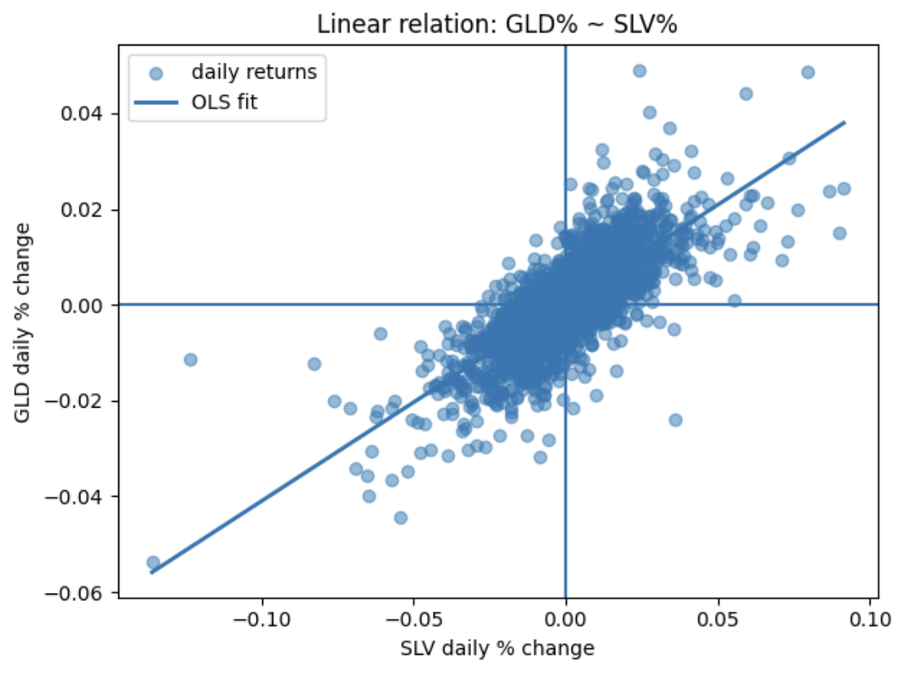

# Gold vs Silver — Linear Relationship  

## Overview  
This project analyzes how **gold (GLD)** and **silver (SLV)** move together on a daily basis.  
It has been refactored into **modular code** with **unit/system tests** and a **Dev Container** for reproducibility.  

The workflow includes:  
- loading and validating the dataset  
- computing daily returns  
- identifying “big SLV move” days  
- summarizing distributions  
- fitting a simple **linear regression** (`GLD_pct ~ SLV_pct`)  
- producing a scatter plot with regression line  
- verifying correctness with automated tests  

> **Dataset**: `gold_data_2015_25.csv` (Kaggle: *Gold Price 2015–2025*)  
> **Goal**: Show a clear, interpretable **linear relation** between GLD and SLV daily returns.  

---

## What I did (Step by Step)  

1. **Restructured into modules**  
   - `gold_analysis/io.py` → data loading  
   - `gold_analysis/transform.py` → returns & filtering  
   - `gold_analysis/model.py` → linear regression  
   - `gold_analysis/viz.py` → plotting helper  

2. **Main script**  
   - `analysing_gold_data.py` orchestrates the pipeline: load → transform → model → visualize.  
   - Prints threshold, slope, intercept, R², and saves a PNG (`image.png`).  

3. **Tests**  
   - `tests/test_io.py` → load_csv behavior  
   - `tests/test_transform.py` → returns & filtering edge cases  
   - `tests/test_model.py` → regression fit checks  
   - `tests/test_viz.py` → ensures plot is saved  
   - `tests/test_system_e2e.py` → full pipeline test  

4. **Dev Container**  
   - `.devcontainer/devcontainer.json` ensures reproducible setup in VS Code Codespaces / Dev Containers.  
   - Comes pre-installed with dependencies (`requirements.txt`).  

5. **Documentation (this README)**  
   - Clear explanation of steps, results, and how to reproduce.  

---

## Data Dictionary  

| Column   | Description                               | Type   |  
|----------|-------------------------------------------|--------|  
| Date     | Trading date                              | date   |  
| SPX      | S&P 500 index level                       | float  |  
| GLD      | Gold price (ETF proxy)                    | float  |  
| USO      | Oil price (ETF proxy)                     | float  |  
| SLV      | Silver price (ETF proxy)                  | float  |  
| EUR/USD  | Euro to U.S. Dollar exchange rate         | float  |  

Derived columns:  
- `GLD_pct` = daily % change of GLD  
- `SLV_pct` = daily % change of SLV  

---

## Results (example run)  

- **Threshold for big SLV moves (90th percentile)**: ~`0.0261` (2.6%)  
- **Regression fit (`GLD_pct ~ SLV_pct`)**:  
  - slope ≈ `0.4126`  
  - intercept ≈ `0.0002`  
  - R² ≈ `0.5796`  

**Interpretation:**  
> Gold and silver show a **positive linear relationship** in daily returns.  
> R² around 0.58 suggests meaningful co-movement, though not perfect.  
> On days of large silver moves, gold’s response varies more, consistent with stronger correlation during volatility.  

**Visualization:**  
  

---

## How to Run  

### Local (Python 3.10+ recommended)  

```bash
# optional: create a virtual environment
# python -m venv .venv
# source .venv/bin/activate   # Windows: .venv\Scripts\activate

# install dependencies
pip install -r requirements.txt

# run tests
pytest -q

# run the analysis script
python analysing_gold_data.py
