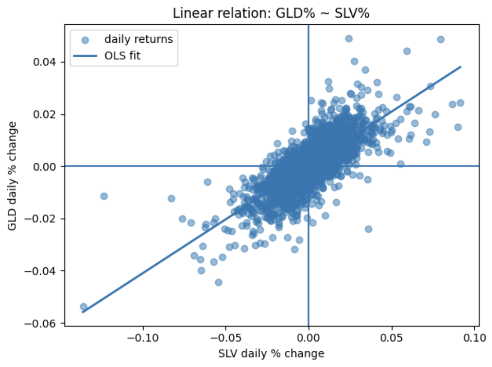

# Gold vs. Silver — Linear Relationship  

## Overview  
This project analyzes how **gold (GLD)** and **silver (SLV)** move together on a daily basis.  
It has been refactored into **modular code** with **unit/system tests** and a **Dev Container** for reproducibility.  

The workflow includes:  
- Loading and validating the dataset  
- Computing daily returns  
- Identifying “big SLV move” days  
- Summarizing distributions  
- Fitting a simple **linear regression** (`GLD_pct ~ SLV_pct`)  
- Producing a scatter plot with regression line  
- Verifying correctness with automated tests  

> **Dataset**: `gold_data_2015_25.csv` (Kaggle: *Gold Price 2015–2025*)  
> **Goal**: Demonstrate a clear, interpretable **linear relationship** between GLD and SLV daily returns.  

---

## Step-by-Step Implementation  

1. **Restructured into modules**  
   - `gold_analysis/io.py` → data loading  
   - `gold_analysis/transform.py` → returns & filtering  
   - `gold_analysis/model.py` → linear regression  
   - `gold_analysis/viz.py` → plotting helper  

2. **Main script**  
   - `analysing_gold_data.py` orchestrates the pipeline: load → transform → model → visualize.  
   - Prints threshold, slope, intercept, R², and saves a plot (`image.png`).  

3. **Tests**  
   - `tests/test_io.py` → verifies `load_csv` behavior  
   - `tests/test_transform.py` → checks return calculations & filtering edge cases  
   - `tests/test_model.py` → regression fit checks  
   - `tests/test_viz.py` → ensures the plot is generated and saved  
   - `tests/test_system_e2e.py` → full pipeline integration test  

4. **Dev Container**  
   - `.devcontainer/devcontainer.json` ensures reproducible setup in VS Code Codespaces / Dev Containers.  
   - Comes pre-installed with dependencies (`requirements.txt`).  

5. **Documentation (this README)**  
   - Clear explanation of workflow, results, and reproducibility steps.  

---

## Data Dictionary  

| Column   | Description                        | Type   |  
|----------|------------------------------------|--------|  
| Date     | Trading date                       | date   |  
| SPX      | S&P 500 index level                | float  |  
| GLD      | Gold price (ETF proxy)             | float  |  
| USO      | Oil price (ETF proxy)              | float  |  
| SLV      | Silver price (ETF proxy)           | float  |  
| EUR/USD  | Euro to U.S. Dollar exchange rate  | float  |  

**Derived columns**:  
- `GLD_pct` = daily % change in GLD  
- `SLV_pct` = daily % change in SLV  

---

## Results (Example Run)  

- **Threshold for big SLV moves (90th percentile):** ≈ `0.0261` (2.6%)  
- **Regression fit (`GLD_pct ~ SLV_pct`):**  
  - Slope ≈ `0.4126`  
  - Intercept ≈ `0.0002`  
  - R² ≈ `0.5796`  

**Interpretation:**  
> Gold and silver exhibit a **positive linear relationship** in daily returns.  
> An R² of ~0.58 indicates meaningful co-movement, though not perfect.  
> On days of large silver moves, gold’s response varies more, consistent with stronger correlation during volatility.  

**Visualization:**  
  

---

## How to Run  

### Local (Python 3.10+)  

```bash
# Install dependencies
pip install -r requirements.txt

# Run main pipeline
python analysing_gold_data.py

```

### Run Tests

```bash
pytest
```